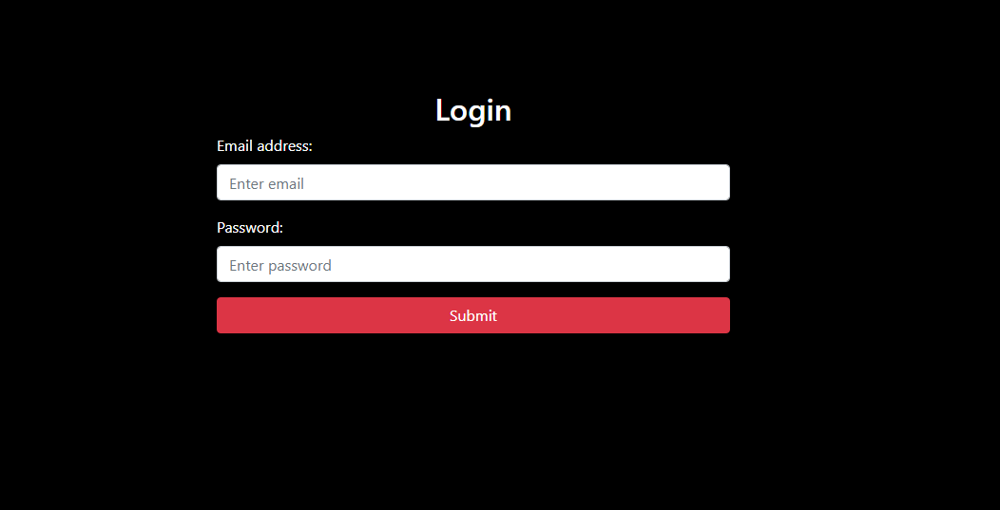
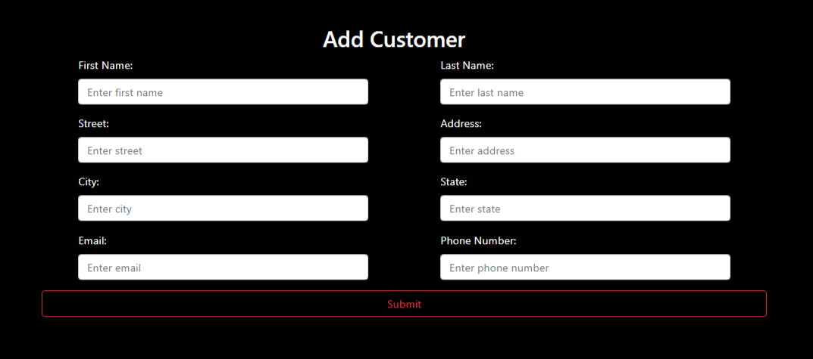
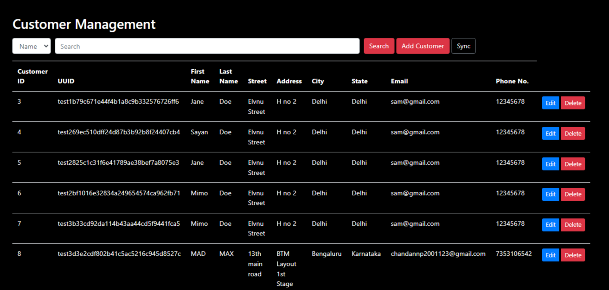

# SunBase Assignment Backend  

This repository contains the codebase for a customer information management API. The primary objective is to implement CRUD operations, with a subsequent phase focused on synchronizing customer data with a remote API to ensure consistency and accuracy.

### Assignment Completion

Use this first http://localhost:8080/ then api end point

1. **Create Customer**
   - Path: `/api/sunbasedata/register-customer`
   - Method: POST
   - Description: Creates a new customer in the system.

2. **Update Customer**
   - Path: `/api/sunbasedata/update-customer/{id}`
   - Method: PUT
   - Description: Update an existing customer.

3. **Get a List of Customers**
   - Path: `/api/sunbasedata/customer-list`
   - Method: GET
   - Description: Retrieve a paginated, sorted, and searchable list of customers.

4. **Get a Customer Based on ID**
   - Path: `/api/sunbasedata/get-customer/{id}`
   - Method: GET
   - Description: Retrieve details of a given customer based on their ID.

5. **Delete a Customer**
   - Path: `/api/sunbasedata/delete-customer/{Id}`
   - Method: DELETE
   - Description: Delete a customer from system.
  
6. **Serach a Cutomer by Name, Email, State etc**
   - Path: `/api/sunbasedata/search-customers`
   - Method: GET
   - Description: Serach a Cutomer by Name, Email, State, City
  
1st Page ( **Login Page**)

2nd Page (**Add customer page**)

3rd Page (**home page (customer details)**)

### Second Part

In the second part, one  additional feature is added:

- **Synchronize List**
  - Description: A button "Sync" is added on the customer list page. By hitting this button it will triggers a call to a remote API to get the customer list. The retrieved customers are then saved in the database. If a customer already exists in the database, their information is updated instead of inserting a new record. for this you need to download frontend repositor or use postman (**for postman**:http://localhost:8080/home/api/customers/search/sunbase)
 
  

### Setup and Usage

1. Clone this repository.
2. Set up the backend environment.
3. excute the code.
4. Clone the fronted code.
5. excute the frontend code.
